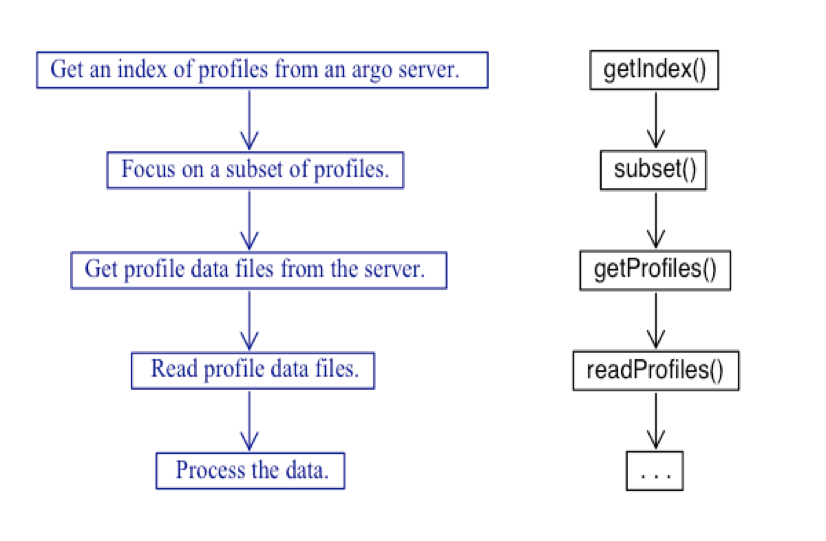
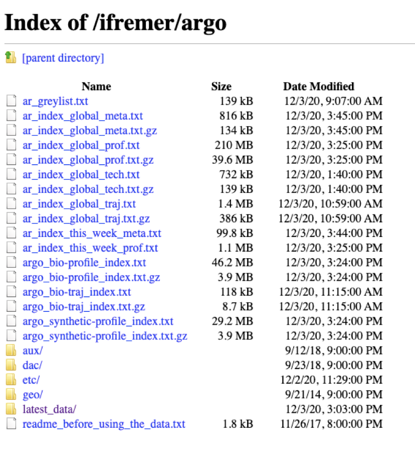
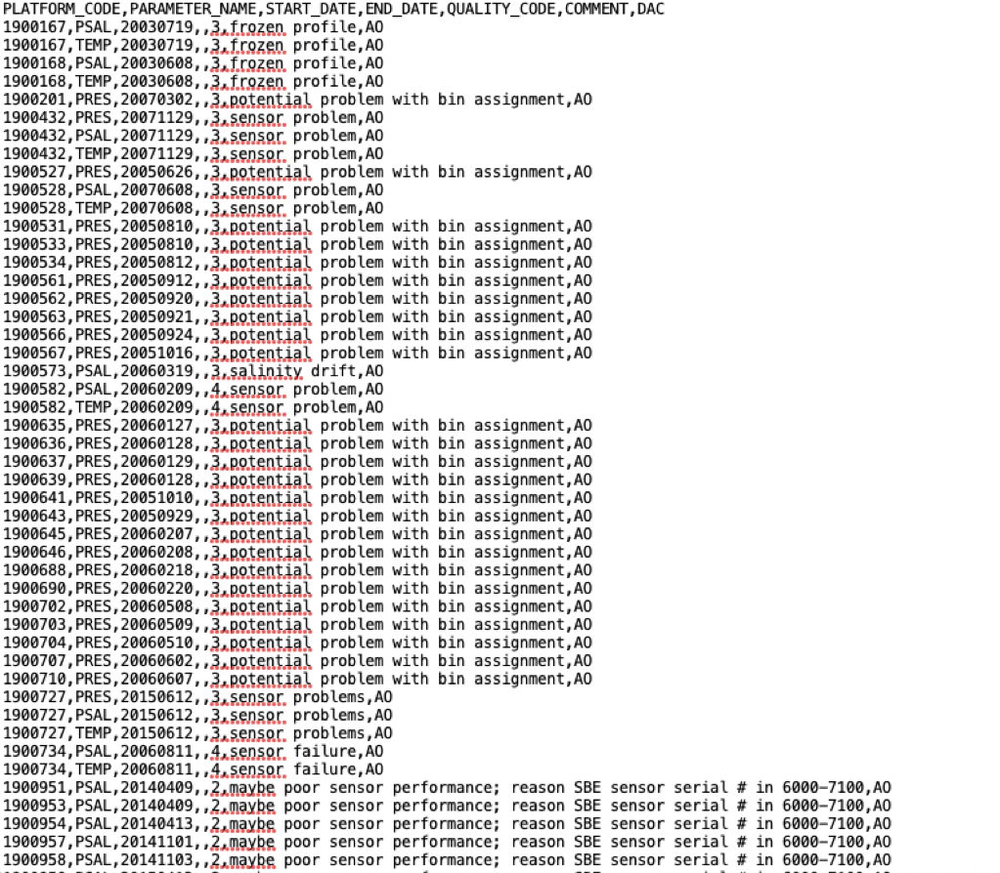
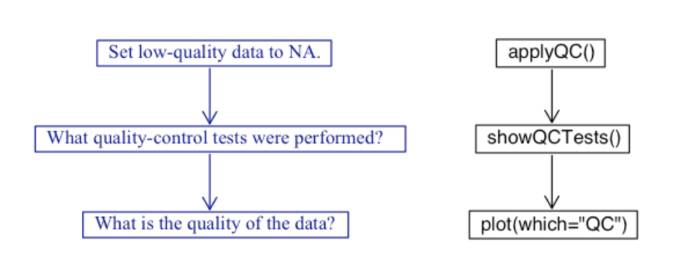
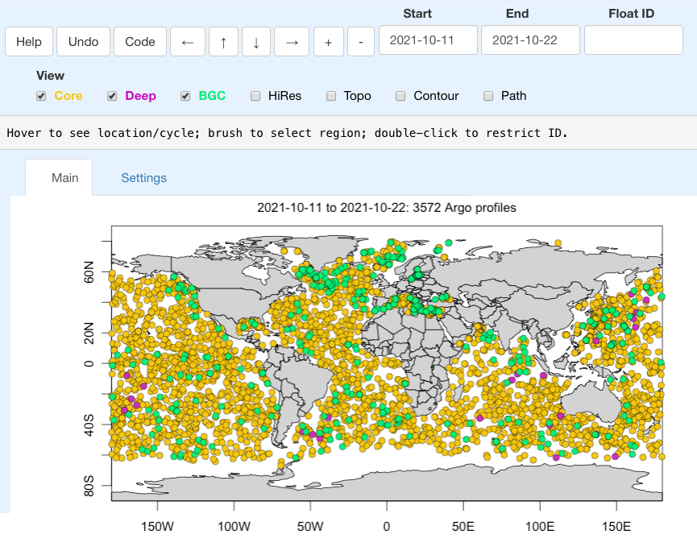

```{r setup, include=FALSE}
knitr::opts_chunk$set(echo = FALSE)
```

Hi Argo community! Today I present to you the `argoFloats` package. Not only does this package make Argo data more accessible by helping to identify, download, cache, and analyze Argo data, it does so in a way that makes it easy for someone with little coding experience.

Before getting ahead of ourselves, let's download and load the package:

```{r, message=FALSE, warning=FALSE, eval=FALSE}
install.packages("argoFloats")
library(argoFloats)
```

```{r, echo=FALSE, message=FALSE, error=FALSE, warning=FALSE}
library(argoFloats)
library(float)
```

To eliminate the gap between Argo data and the end user, we created an easy 5 step process, shown below.



## getIndex()

`getIndex()`, the foundational tool of the package, queries an Argo server for an index of data files. Various servers can be used, with the default being to try Infremer and USGODAE in turn. The possible indices are listed below.

| File Name                             | Nickname               | Contents                               |
|---------------------------------------|------------------------|----------------------------------------|
| `ar_greylist.txt`                     | \-                     | Suspicious/malfunctioning floats       |
| `ar_index_global_meta.txt.gz`         | \-                     | Metadata files                         |
| `ar_index_global_prof.txt.gz`         | `"core"`               | Argo data                              |
| `ar_index_global_tech.txt.gz`         | \-                     | Technical files                        |
| `ar_index_global_traj.txt.gz`         | \-                     | Trajectory files                       |
| `argo_bio-profile_index.txt.gz`       | `"bgc"` or `"bgcargo"` | Biogeochemical data (without S or T)   |
| `argo_bio-traj_index.txt.gz`          | \-                     | Biogeochemical trajectory files        |
| `argo_synthetic-profile_index.txt.gz` | `"synthetic"`          | Synthetic data, successor to `"merge"` |

Using `getIndex()` saves the user from having to understand the file structures on the various servers (which are similar, but not quite the same).  So, for example, a user need not study an FTP listing such as

```{r, echo=FALSE}

```

but instead would simply write


```{r, eval=FALSE}
library(argoFloats)
ai <- getIndex(server="ifremer", filename = "core")
```

Easy, right? Now what about the next barrier? How do we cache an index to speed up our download? As of today (2021-10-19), there are 2527015 Argo profiles files. That means 2527015 files that look like this (ftp.ifremer.fr):

```{r, echo=FALSE}

```

Continuously downloading this index can be tiresome and time consuming. To avoid this problem, we created the `age` argument in `getIndex()`. This lets the user indicate how old a downloaded file must be (in days), for it to be considered out-of-date. For example

```{r, eval=FALSE}
ai <- getIndex(server="ifremer", filename = "core", age=10)
```

indicates that `getIndex()` should return a previously-downloaded index, provided that it was downloaded less than 10 days ago.  Since the previous index would have been downloaded with `getIndex()`, we call this process "caching".

## subset()

The indices (obtained with `getIndex()` and possibly subset using `subset,argoFloats-method`) store information about individual argo data files, including: the name of the data file, the date of observation, the observation location (latitude, longitude, and ocean), the profiler type, the institution that owns the float, and the most recent time of data update.

Once the indices are downloaded, a burning question still remains. How in the world do we handle over two million profiles? The answer to this is to use `subset()`, which provides the ability to subset by ID, time, geography, variable, institution, ocean, dataMode, cycle, direction, profile, dataStateIndicator, section, etc. This makes it easy to sift through the data based on parameters that the user is likely to be interested in. For more details and examples of each type of subset look at the help docs for subset within the `argoFloats` package.

Lets consider Argo floats near Nova Scotia. If a user wanted to only look at the core Argo profiling files within a 250 km radius of Halifax, Nova Scotia, they would do the following:


```{r, error=FALSE, warning=FALSE, message=FALSE}
ai <- getIndex(server="ifremer", filename = "core", age=10) # Get the core index from Infremer and cache
index1 <- subset(ai, circle=list(longitude=-63.74, latitude=44.68, radius=250)) # Subset for a 250 radius around NS
plot(index1) # Specialized plot function within argoFloats
```


## getProfiles() and readProfiles()

To take a deeper dive (excuse the pun) into the data stored within individual Argo data files, the user must download the data files, typically done with `getProfiles()`, and then read those file, typically with `readProfiles()`.

To continue with our example, we might use

```{r, eval=FALSE}
profiles <- getProfiles(index1) # create list of files to read
argos <- readProfiles(profiles) # read the desired profiles
```

to download and read the data files.  Note that `getProfiles()` uses an age-based cache, just like `getIndex()` does, to speed up processing.

## Analyzing Argo data

The `argoFloats` package has a suite of functions for analyzing Argo data, and these work well with the functions provided by the `oce` package (Kelley and Richards, 2021). These are described in great detail in our paper (Kelley et al. 2021) as well as the help documentation. As with `oce`, there is an emphasis on simplicity and a philosophy of isolating users from the details of storage. For example, the `[[` operator provides a way to extract items from `argoFloats` objects, with e.g. `index[["file"]]` being a replacement for `index@data$index$file`.  Similarly, it is easy to extract individual Argo objects from a collection, and data within those objects, including derived data (such as potential temperature).

Plotting being an important component of analysis, `argoFloats` provides specialized plots for maps, profiles, temperature-salinity, quality control analysis, to name a few.  Continuing with our example,

```{r, error=FALSE, warning=FALSE, message=FALSE}
profiles <- getProfiles(index1) # create list of files to read
argos <- readProfiles(profiles) # read the desired profiles
plot(argos, which="TS") # specialized TS plot
```

gives a temperature-salinity plot for a set of Argo profiles.

## Quality Control

Uh oh! What are all of those red points in the TS diagram shown above? That TS diagram must be useless, right? Wrong. We've got you covered. `argoFloats` has also included a three-step process for dealing with Quality Control of Argo data.

```{r, echo=FALSE}

```

### applyQC

To first answer the question, "What are all of those red dots in the TS diagram?" They are points that were flagged as "bad" during quality control. The `applyQC()` function identifies any points that are classified as "bad" and sets them to NA to not be used in future plots or calculations.

Let's take a look at the impact of `applyQC()` where the left hand side shows before `applyQC()` was done and the right hand side shows after it was completed.

```{r, error=FALSE, warning=FALSE, message=FALSE}
clean <- applyQC(argos) # set bad data to NA
par(mfrow=c(1,2))
plot(argos, which="TS") # specialized TS plot
plot(clean, which="TS")
```

### showQCTests()

Although that was easy, your work is not done yet. It's always a good idea to know *why* a certain point was flagged as bad. That is where `showQCTests()` comes into play. This function reveals which tests were passed and failed for each particular Argo profile. In our example, we might want to loop through all of the profiles in `argos` and when a "bad" point is encountered, display which tests were performed/failed. Note for the sake of space, the output is not shown.


```{r, eval=FALSE}
badFlag <- c(0,3,4,9)
cycles <- argos[["argos"]]

for (x in seq_along(cycles)) {
    thisCycle <- cycles[[x]]
    if (any(thisCycle[["salinityFlag"]] %in% badFlag)) {
        message("Float ID ", unique(thisCycle[["ID"]]), " at cycle position ", x," ie. cycle number ", unique(thisCycle[["cycleNumber"]])," is flagged bad")
        showQCTests(thisCycle)
        }}
```


### plot(x, which="QC")

For a last QC visual, we can use the `plot(x, which="QC")`. Let's take the first output (ie. float number 4901400) from above. As stated by the output, it failed the Density Inversion and Grey List test. We can look at the quality of each cycle in the data by doing the following:

```{r, error=FALSE, warning=FALSE, message=FALSE}
ai <- getIndex(server="ifremer", filename = "core") # Get the core index from Infremer and cache
index2 <- subset(ai, ID="4901400")
profiles2 <- getProfiles(index2)
argos2 <- readProfiles(profiles2)
plot(argos2, which="QC") # Note we can change the parameter
```


## mapApp()

Lastly, just in case `argoFloats` wasn't cool enough, we've also created an app, named `mapApp()`, which is a way to analyze spatial-temporal distribution of Argo profiles. One neat feature about `mapApp()` is the "Code" button. This button shows a popup window containing R code that performs the basic steps used to isolate data for the `mapApp()` display. It even provides code for some reasonable next steps, such as downloading, reading, and plotting the Argo profile data.

```{r, echo=FALSE}

```

# References

Kelley, D. E., Harbin, J., & Richards, C. (2021). argoFloats: An R package for analyzing Argo data. Frontiers in Marine Science, 8, 636922. https://doi.org/10.3389/fmars.2021.635922

Kelley, D., and Richards, C. (2020). oce: Analysis of Oceanographic Data. Available online at: https://CRAN.R-project.org/package=oce (accessed October 22, 2021).


